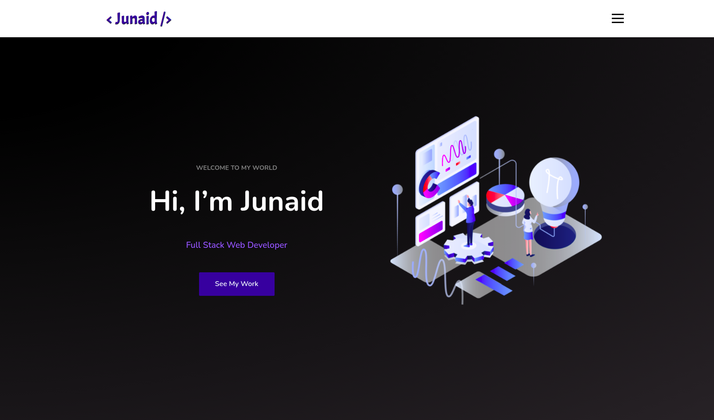
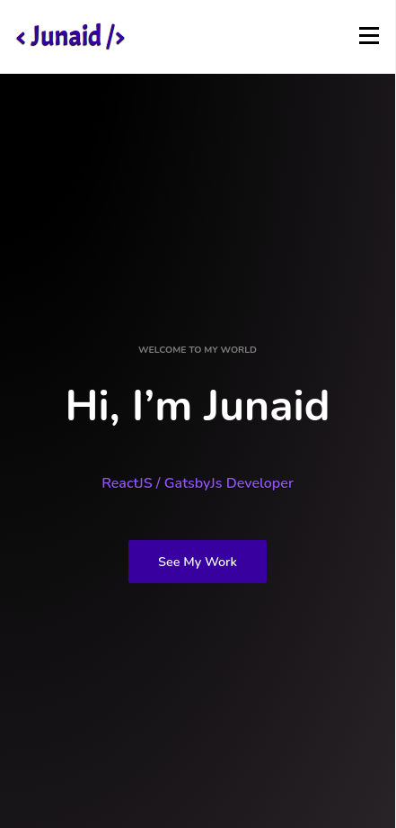

# 👨‍💻 Personal DevFolio

### _Personal Portfolio built using ReactJs and Animation libraries, hope you like it. Tweak it and use it !!_

### Demo Video

:link: https://youtu.be/ZamUKgjzB3Q

### Link :link: https://developer-junaid.web.app/

## Images

## Mobile Responsive

## Run Locally

- Run this command `git clone https://github.com/developer-junaid/DeveloperFolio.git`
- You are now in the dev environment and you can play around

## Tech Stack

- HTML5
- CSS3
- Javascript ES6
- React js

- Animation Libraries
- - react-scroll
- - aos
- - custom css animation
- - framer-motion

- Firebase
- Github Actions
