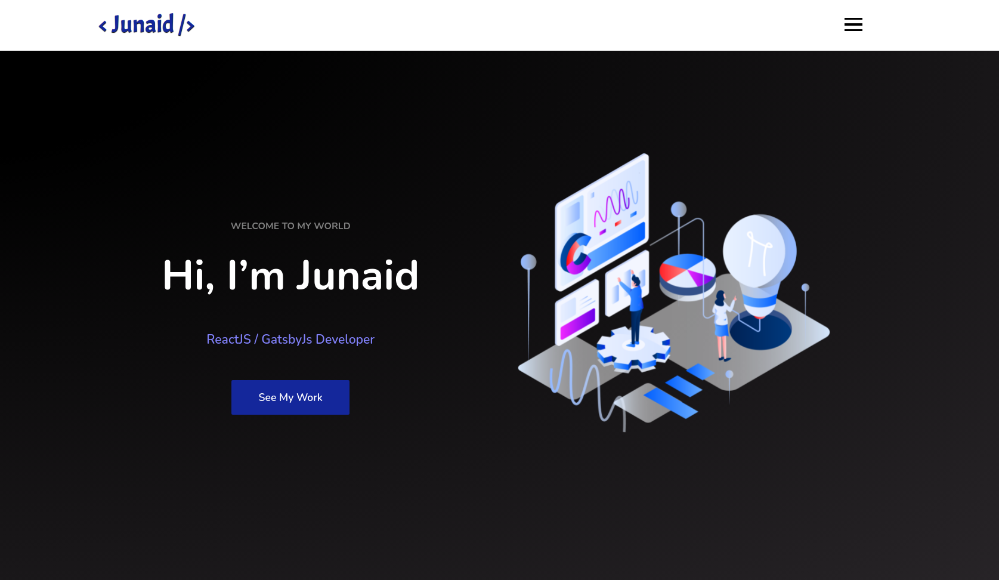
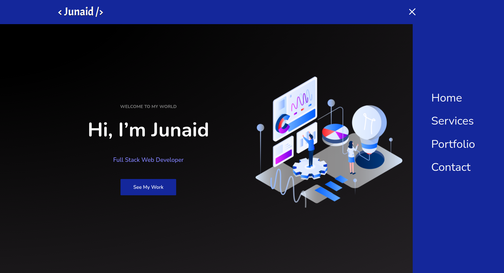
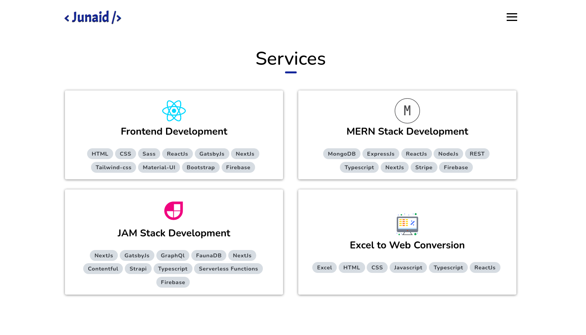
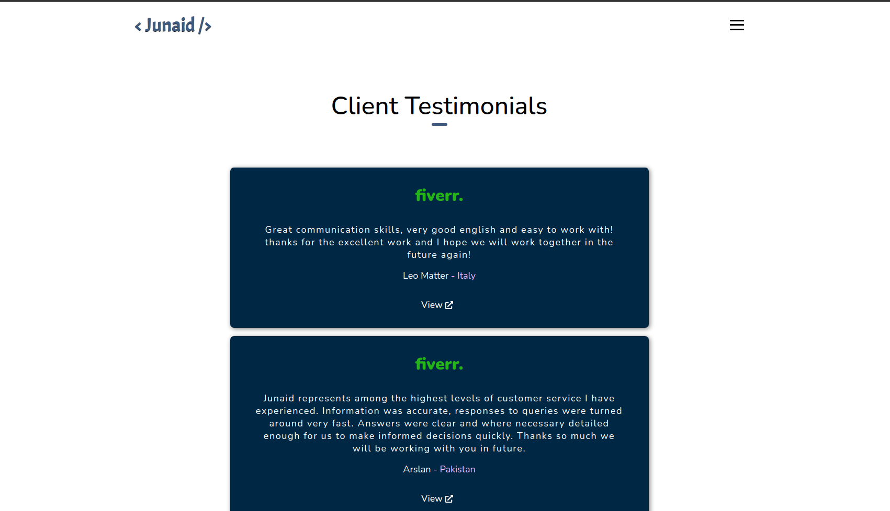
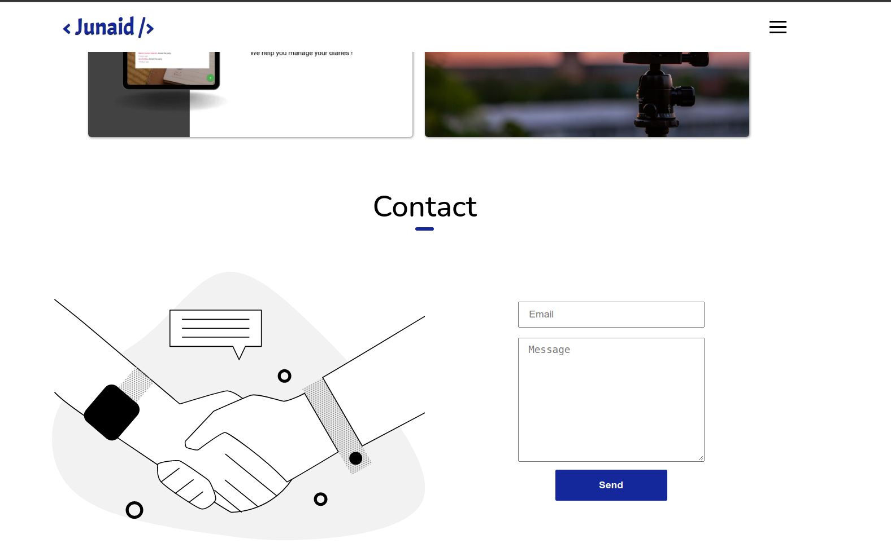

# 👨‍💻 Personal DevFolio (2.0)

### _Personal Portfolio built using ReactJs and Animation libraries, hope you like it. Tweak it and use it !!_

### Demo Video (2.0) :link: https://youtu.be/soi-rnv9dDQ

### Link :link: https://developerjunaid.com/

## Images

## Mobile Responsive

## Run Locally

- Run this command `git clone https://github.com/developer-junaid/DeveloperFolio.git`
- You are now in the dev environment and you can play around

## Tech Stack

- HTML5
- CSS3
- Javascript ES6
- React js

- Animation Libraries
- - react-scroll
- - aos
- - custom css animation
- - framer-motion

- Firebase
- Github Actions
