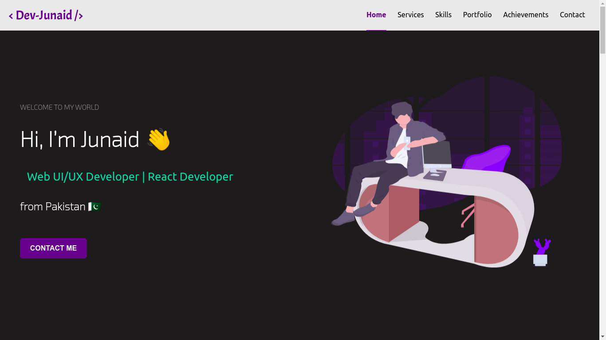
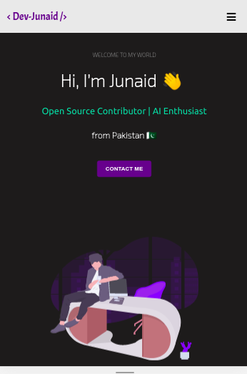

# 👨‍💻 Personal DevFolio

### *Personal Portfolio built using ReactJs and Animation libraries, hope you like it. Tweak it and use it !!*
:link: http://junaid-qureshi.surge.sh/

### Demo Video
:link: https://youtu.be/DNfXLD9lPi0

## Images 

## Mobile Responsive

## Run Locally 

- Run this command `git clone https://github.com/developer-junaid/Developerfolio.git`
- You are now in the dev environment and you can play around 

## Tech Stack

- HTML5
- CSS3
- Javascript ES6
- React js

- Animation Libraries
- - react-scroll
- - aos
- - custom css animation
- - framer-motion

- Surge
- Github Actions
